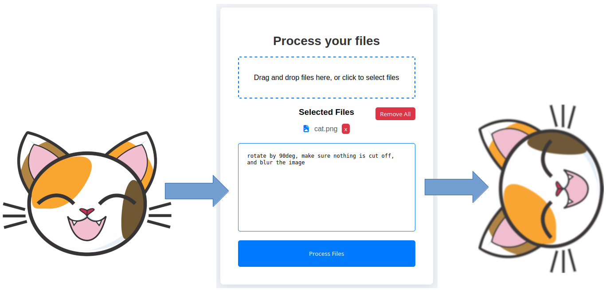
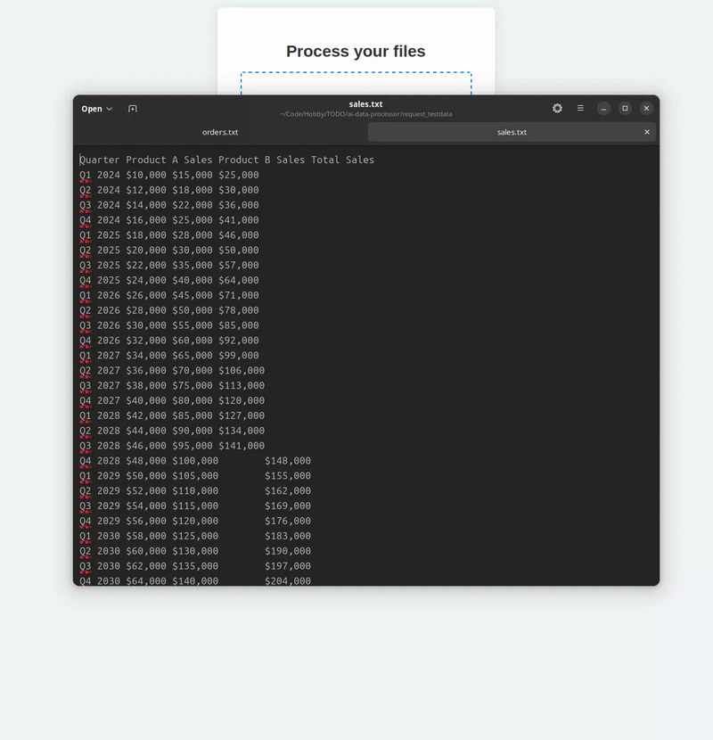

  <h1>AI File Processor</h1>
  

    
    
    
    
  

  
<b>AI File Processor</b> is a web-based tool that uses large language models (LLMs) to generate Python code for processing uploaded files. It features a secure, containerized execution environment and supports multi-file workflows.

## 🔧 Features

- **LLM-Powered Code Generation**  
  Processes files using Python code generated by LLMs. A lightweight Retrieval-Augmented Generation (RAG) approach provides context to the model by including filenames and file previews (e.g., the first few lines of text documents).

- **Secure, Isolated Execution**  
  Each request is executed in a separate Podman container to sandbox generated code and enhance security.

- **Multi-File Input & Output**  
  Accepts multiple files in a single prompt and returns results either as individual files or as a `.zip` archive.

- **Retry Mechanism**  
  Automatically retries code generation if the model fails to produce valid Python (default: 2 retries).

- **Modern Tech Stack**  
  Built with a React frontend and a Python/Django backend.

- **Flexible LLM Backend**  
  Uses Groq by default for LLM requests, but can be easily configured to use OpenAI or other providers.

- **Optional Dependency Detection**  
  Includes (disabled by default) support for inferring required Python libraries from the generated code to improve automation.

## 🚀 Getting Started
### Installation
The installation instructions are tested on Ubuntu 24 using Python 3.12 and may differ depending on your system
#### Backend
Navigate to the backend directory and
1. Put your Groq API key in backend/adp/settings.py
2. Install podman:   
`sudo apt install podman`   
3. Create virtual environment  
`python3 -m venv venv`
4. Activate virtual environment  
`source venv/bin/activate`
5. Install requirements:  
`pip install -r requirements.txt`

#### Frontend
Navigate to the frontend directory and
1. Install dependencies:   
`npm install`
2. Run the frontend using  
`npm start`

## 📹 Video Demo

